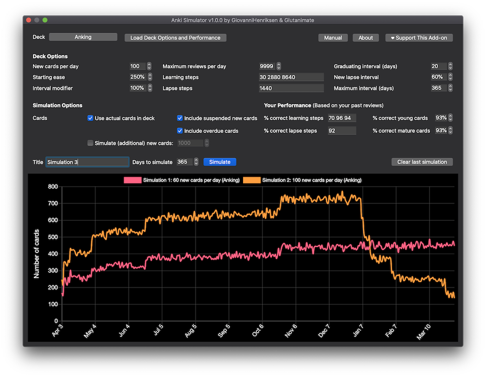

# Anki Simulator

Anki Simulator is an add-on for Anki that simulates Anki progress over time using the user's cards, deck options and statistics. More info can be found on the Reddit thread.

- [Installation](#Installation)
- [Building](#Building)
- [Contributing](#Contributing)
- [Authors](#Authors)
- [License](#License)

## Installation
Recommended: Anki Simulator can be easily installed through on Ankiweb.
Alternatively, download and open the latest .ankiaddon package from the releases tab

## Building
You can build Anki Simulator using [Anki add-on builder](https://github.com/glutanimate/anki-addon-builder/):

    git clone https://github.com/giovannihenriksen/Anki-Simulator.git
    cd Anki-Simulator
    aab build
    
## Contributing
Anyone is free to suggest new features, submit issues or create pull requests.

## Authors 

* **GiovanniHenriksen** 
* **Aristotelis P.** - [Glutanimate](https://glutanimate.com)

## License
© 2020 GiovanniHenriksen & Aristotelis P. (Glutanimate)

Anki Simulator is free software: you can redistribute it and/or modify it under the terms of the GNU Affero General Public License as published by the Free Software Foundation, either version 3 of the License, or (at your option) any later version.

This program is distributed in the hope that it will be useful, but WITHOUT ANY WARRANTY; without even the implied warranty of MERCHANTABILITY or FITNESS FOR A PARTICULAR PURPOSE. See the GNU Affero General Public License for more details. For more information please see the LICENSE file that accompanied this program.

Anki Simulator ships with [Chart.js](https://www.chartjs.org), (c) 2019 Chart.js Contributors (available under the [MIT license](https://opensource.org/licenses/MIT))
